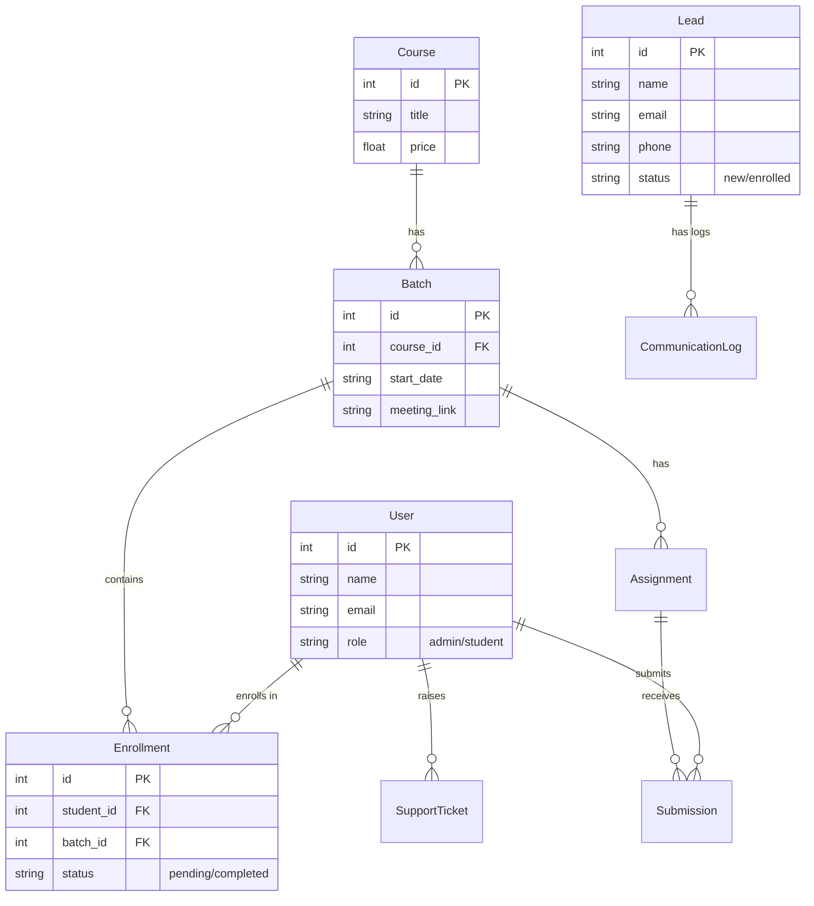

# Project Overview: AI-Powered Python Coaching Center

This document provides a complete guide to the project, tailored for both non-technical stakeholders and developers.

---

## 🌟 Part 1: For Business Owners & Stakeholders (Layman's Terms)

### 🎯 What is this project?
This is a **smart management system** designed specifically for a Python Coaching Center. It acts as a digital assistant that handles everything from finding new students to managing their classes.

Think of it as having a **24/7 receptionist and manager** who:
1.  Talks to interested students immediately (via WhatsApp, Email, and even Voice Calls!).
2.  Collects fees securely.
3.  Organizes classes and study materials for students.
4.  Gives you a dashboard to see how your business is growing.

### 🚀 Key Benefits

#### 1. Instant Student Engagement (Zero Wait Time)
When someone asks about a course on your website, the system **immediately**:
*   Sends them a **WhatsApp message** with course details.
*   Sends an **Email** with the syllabus.
*   **Calls them** (using AI) to welcome them and answer basic questions.
*   *Result: You never lose a lead because you were too busy to reply.*

#### 2. Hassle-Free Payments
Students can pay fees online using familiar apps like **PhonePe**. The system automatically tracks who has paid and unlocks their course access. No more manual checking of screenshots!

#### 3. Professional Student Experience
Students get their own **Student Portal** where they can:
*   See their class schedule.
*   Join live classes with one click.
*   Watch recordings of past classes.
*   Submit assignments.

#### 4. Admin Command Center
You get a powerful **Admin Dashboard** to:
*   See all new inquiries (Leads).
*   Track total revenue.
*   Manage batches and courses.

---

## 💻 Part 2: For Developers (Technical Terms)

#### Data Dictionary

| Entity | Description | Key Relationships |
| :--- | :--- | :--- |
| **User** | Represents all authenticated users (Admins, Students). | Parent to Enrollments, Submissions, Tickets. |
| **Lead** | Potential students who have inquired via the landing page. | Has many CommunicationLogs. |
| **Course** | The educational product (e.g., "Python Mastery"). | Parent to Batches. |
| **Batch** | A specific scheduled instance of a Course (e.g., "Nov 2023 Batch"). | Belongs to Course; Has many Enrollments & Assignments. |
| **Enrollment** | Link between a Student and a Batch, tracking payment and access. | Links User and Batch. |
| **Assignment** | Homework or projects assigned to a specific batch. | Belongs to Batch; Parent to Submissions. |
| **Submission** | A student's work for a specific assignment. | Links User and Assignment. |
| **CommunicationLog** | Audit trail of automated messages sent to leads. | Belongs to Lead. |
| **SupportTicket** | Help requests raised by students. | Belongs to User. |

### 🌐 Full Stack Data Flow

How data moves through the system:

1.  **Frontend (React Component)**
    *   User interacts with UI (e.g., clicks "Enroll").
    *   `api.js` makes an HTTP POST request to the backend.
    *   *Example Payload*: `{ "batch_id": 1, "student_id": 5 }`

2.  **API Layer (FastAPI Router)**
    *   `main.py` receives the request.
    *   **Pydantic Schemas** (`schemas.py`) validate the data format.
    *   **Auth Middleware** (`auth.py`) checks the JWT token to ensure the user is logged in.

3.  **Service/Logic Layer**
    *   The endpoint function executes business logic (e.g., "Check if already enrolled").
    *   If external actions are needed (e.g., Payment Gateway), a service module (`payment_service.py`) is called.

4.  **Data Access Layer (SQLModel)**
    *   The code interacts with the database using Python objects.
    *   *Example*: `session.add(enrollment)`
    *   SQLModel translates this into a SQL `INSERT` query.

5.  **Database (SQLite/Postgres)**
    *   The row is inserted into the `enrollment` table.
    *   Constraints (Foreign Keys) ensure data integrity.

6.  **Response**
    *   The database returns the new ID.
    *   FastAPI serializes the object back to JSON.
    *   Frontend receives the response and updates the UI state.

1.  **Ingestion**: User submits form on Landing Page -> `POST /public/leads`.
2.  **Persistence**: Data is validated (Pydantic) and saved to the `Lead` table in the DB.
3.  **Automation (Async)**:
    *   Background tasks trigger `send_whatsapp_notification`.
    *   Background tasks trigger `send_email_notification`.
    *   Background tasks trigger `call_service.initiate_call`.
4.  **Conversion**: Admin "Enrolls" a lead -> Lead data moves to `User` (Student) and `Enrollment` tables.

### 📂 Project Structure Overview

*   `backend/`: Contains all Python code.
    *   `main.py`: Entry point, defines API routes.
    *   `models.py`: Database schema definitions.
    *   `services/`: Modules for external API logic.
*   `frontend/`: Contains all React code.
    *   `src/components/`: UI components (LandingPage, Dashboard, etc.).
    *   `src/utils/api.js`: Centralized API client (Axios).

### 🛡️ Security & Best Practices
*   **Authentication**: JWT (JSON Web Tokens) for secure login.
*   **Environment Variables**: All sensitive keys (API keys, DB URL) are stored in `.env` files, never hardcoded.
*   **CORS**: Configured to allow requests only from the trusted frontend domain.

---

## 🏁 Getting Started

To run this project locally:
1.  **Backend**: `cd backend` -> `pip install -r requirements.txt` -> `python -m uvicorn backend.main:app --reload`
2.  **Frontend**: `cd frontend` -> `npm install` -> `npm run dev`
3.  **Access**: Open `http://localhost:5173`
