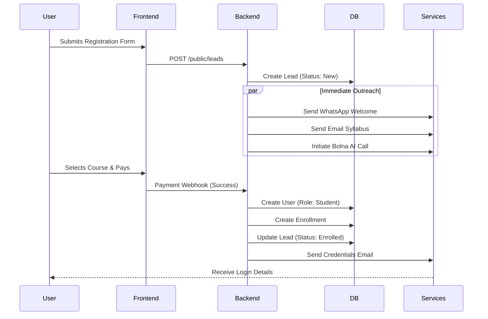
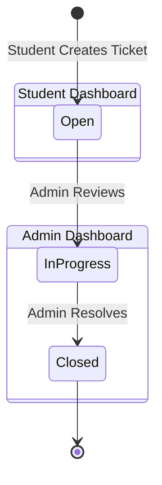

# AI-Powered Python Coaching Center

A comprehensive, automated coaching center management system designed to streamline marketing, enrollment, education delivery, and student support. This system leverages AI and modern web technologies to provide a seamless experience for both administrators and students.

## 🚀 Features

### 🤖 Automation & Marketing
- **Multi-Channel Lead Capture**: Capture leads via landing pages and CSV imports.
- **Automated Outreach**:
    - **WhatsApp**: Instant welcome messages via AiSensy.
    - **Email**: Syllabus and welcome kits via SendGrid.
    - **AI Voice Calls**: Automated introductory calls using Bolna AI.
- **Lead Conversion**: Automated conversion of leads to students upon payment.

### 🎓 Student Management
- **Dynamic Class Selection**: Students can choose courses during registration.
- **Secure Authentication**: JWT-based auth with auto-generated secure credentials.
- **Student Dashboard**:
    - View enrolled classes and schedules.
    - Access assignments and submit work.
    - Track progress and grades.
    - **Certificates**: Download course completion certificates (PDF).
    - **Support**: Raise and track support tickets.

### 🖥️ Admin Dashboard Guide

The Admin Dashboard is the central command center for managing the coaching center. Here's a breakdown of each tab:

#### 1. **Overview**
- **Purpose**: High-level snapshot of the institute's performance.
- **Key Metrics**: Total Leads, Active Students, Total Revenue, Active Batches.
- **Visuals**:
    - **Enrollment Trends**: Line chart showing student sign-ups over the last 7 days.
    - **Lead Status Distribution**: Pie chart breaking down leads by status (New, Contacted, Converted, etc.).

#### 2. **Leads**
- **Purpose**: CRM for managing potential students.
- **Features**:
    - **List View**: View all leads with details (Name, Email, Phone, Role).
    - **Filters**: Filter by role (Student/Parent) or search by name/email.
    - **Actions**:
        - **Manual Convert**: Instantly convert a lead to a student (generates credentials & sends welcome email).
        - **Bulk Outreach**: Select multiple leads to send bulk WhatsApp or Email updates.
        - **Import CSV**: Bulk upload leads from a CSV file.

#### 3. **AI Marketing**
- **Purpose**: Generate and broadcast marketing content using AI.
- **Features**:
    - **Content Generation**: Enter a topic (e.g., "Python Workshop"), and AI generates a professional message.
    - **Multi-Channel Broadcast**: Send the generated message via Email or WhatsApp to selected leads.

#### 4. **Classes**
- **Purpose**: Manage course batches and schedules.
- **Features**:
    - **Create Batch**: Schedule new batches with start dates, timings, and meeting links.
    - **Manage Enrollments**: View students in a batch and manually enroll new ones.
    - **Certificate Issuance**: Issue course completion certificates to students in a specific batch.

#### 5. **Support**
- **Purpose**: Helpdesk for student queries.
- **Features**:
    - **Ticket Management**: View all support tickets raised by students.
    - **Status Tracking**: Update ticket status (Open -> In Progress -> Closed) as you resolve them.

#### 6. **Email** (New!)
- **Purpose**: Two-way email communication center.
- **Features**:
    - **Inbox/History**: View full email conversation history with any lead or student.
    - **Compose**: Send individual emails directly from the dashboard.
    - **Inbound Support**: Receive and display student replies in real-time (requires webhook setup).



### 2. Support Ticket Workflow



## 📋 Prerequisites

- **Python**: 3.10+
- **Node.js**: 20+
- **npm**: 10+

## 🛠️ Installation & Setup

### 1. Backend Setup

```bash
cd backend
pip install -r requirements.txt

# Configure Environment
# Create .env in root directory (see Environment Variables section)
```

### 2. Frontend Setup

```bash
cd frontend
npm install
```

### 3. Environment Variables

Create a `.env` file in the **root directory** (`week1/.env`):

```env
DATABASE_URL=sqlite:///database.db
SECRET_KEY=your_secret_key_here
ALGORITHM=HS256
ACCESS_TOKEN_EXPIRE_MINUTES=30

# External Services
SENDGRID_API_KEY=your_key
AISENSY_API_KEY=your_key
BOLNA_API_KEY=your_key
OPENAI_API_KEY=your_key
BOLNA_AGENT_ID=your_agent_id

# Payments
PHONEPE_MERCHANT_ID=your_id
PHONEPE_SALT_KEY=your_key
```

## 🏃 Running the Application

1.  **Start Backend**:
    ```bash
    # From root directory
    python -m uvicorn backend.main:app --reload --port 8000
    ```

2.  **Start Frontend**:
    ```bash
    cd frontend
    npm run dev
    ```

3.  **Access**:
    - App: `http://localhost:5173`
    - API Docs: `http://localhost:8000/docs`

## 🔑 Default Credentials

| Role | Email | Password |
|------|-------|----------|
| **Admin** | `admin@example.com` | `admin123` |
| **Student** | `teststudent@example.com` | `password123` |

## 📁 Project Structure

```
week1/
├── backend/
│   ├── main.py              # Application Entry Point
│   ├── models.py            # Database Models (User, Lead, Course, etc.)
│   ├── schemas.py           # Pydantic Schemas (Validation)
│   ├── services/            # Business Logic & Integrations
│   │   ├── call_service.py  # Bolna AI Integration
│   │   ├── email_service.py # SendGrid Integration
│   │   └── ...
│   └── ...
├── frontend/
│   ├── src/
│   │   ├── components/      # React Components (Dashboard, Login, etc.)
│   │   └── ...
│   └── ...
├── .env                     # Configuration
└── README.md                # Documentation
```

## 🧪 Testing

Run the included test scripts to verify functionality:

```bash
python test_backend.py          # General API Tests
python test_call.py             # Verify Bolna AI Call
python verify_support_tickets.py # Verify Support System
```